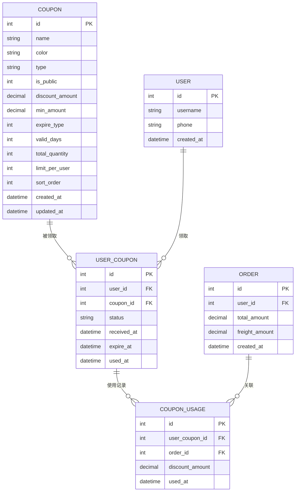
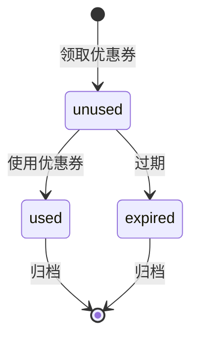

# 数据模型：优惠券领取功能

**创建日期**：2026-01-16
**最后更新**：2026-01-16
**状态**：草稿

---

## 1. 数据模型概览

### 1.1 实体关系图

### 1.2 实体汇总

| 实体 | 描述 | 关键属性 | 关系 |
|------|------|----------|------|
| **Coupon** | 优惠券主表 | id, name, discount_amount | 被多个UserCoupon引用 |
| **UserCoupon** | 用户优惠券关联表 | id, user_id, coupon_id, status | 属于User和Coupon，有多个CouponUsage |
| **User** | 用户表 | id, username | 拥有多个UserCoupon |
| **CouponUsage** | 优惠券使用记录 | id, user_coupon_id, order_id | 属于UserCoupon和Order |
| **Order** | 订单表 | id, user_id, freight_amount | 有多个CouponUsage |

---

## 2. 实体定义

### 2.1 Coupon（优惠券）

#### 基本信息

| 属性 | 值 |
|------|-----|
| **实体ID** | ENT-001 |
| **名称** | Coupon |
| **描述** | 优惠券配置信息，由后台管理员创建和管理 |
| **限界上下文** | 营销促销域 |
| **聚合根** | 是 |

#### 属性

| 属性 | 类型 | 必填 | 唯一 | 默认值 | 描述 | 约束 |
|------|------|------|------|--------|------|------|
| `id` | int | 是 | 是 | AUTO_INCREMENT | 主键 | 自增ID |
| `name` | string | 是 | 否 | - | 优惠券名称 | 1-100字符，如"满100减10优惠券" |
| `color` | string | 否 | 否 | `#FF6B6B` | 优惠券颜色 | 十六进制颜色值 |
| `type` | string | 是 | 否 | `freight` | 优惠券类型 | [freight, recharge, other] |
| `is_public` | int | 是 | 否 | 1 | 是否公开到领券中心 | 0=不公开, 1=公开 |
| `discount_amount` | decimal(10,2) | 是 | 否 | - | 减免金额 | > 0 |
| `min_amount` | decimal(10,2) | 是 | 否 | 0 | 最低消费金额 | >= 0 |
| `expire_type` | int | 是 | 否 | 1 | 到期类型 | 1=固定天数, 2=固定日期 |
| `valid_days` | int | 否 | 否 | 7 | 有效天数 | 当expire_type=1时必填 |
| `total_quantity` | int | 是 | 否 | - | 发放总数量 | > 0 |
| `limit_per_user` | int | 是 | 否 | -1 | 每用户限领数量 | -1=不限制, >0=具体数量 |
| `sort_order` | int | 是 | 否 | 0 | 排序值 | 越小越靠前 |
| `created_at` | datetime | 是 | 否 | NOW() | 创建时间 | ISO 8601 |
| `updated_at` | datetime | 是 | 否 | NOW() | 更新时间 | ISO 8601 |

#### 业务规则

| 规则ID | 规则 | 验证 |
|--------|------|------|
| BR-001 | 减免金额必须小于等于最低消费金额 | discount_amount <= min_amount |
| BR-002 | 公开到领券中心的优惠券必须有库存 | is_public=1 时，total_quantity > 0 |
| BR-003 | 固定天数类型必须设置有效天数 | expire_type=1 时，valid_days > 0 |

#### 索引

| 索引名称 | 列 | 类型 | 用途 |
|----------|-----|------|------|
| `idx_is_public_sort` | is_public, sort_order | B-tree | 领券中心列表查询优化 |
| `idx_created_at` | created_at | B-tree | 时间范围查询 |

---

### 2.2 UserCoupon（用户优惠券）

#### 基本信息

| 属性 | 值 |
|------|-----|
| **实体ID** | ENT-002 |
| **名称** | UserCoupon |
| **描述** | 用户领取的优惠券记录 |
| **限界上下文** | 营销促销域 |
| **聚合根** | 否 |

#### 属性

| 属性 | 类型 | 必填 | 唯一 | 默认值 | 描述 | 约束 |
|------|------|------|------|--------|------|------|
| `id` | int | 是 | 是 | AUTO_INCREMENT | 主键 | 自增ID |
| `user_id` | int | 是 | 否 | - | 用户ID | 外键关联User.id |
| `coupon_id` | int | 是 | 否 | - | 优惠券ID | 外键关联Coupon.id |
| `status` | string | 是 | 否 | `unused` | 状态 | [unused, used, expired] |
| `received_at` | datetime | 是 | 否 | NOW() | 领取时间 | ISO 8601 |
| `expire_at` | datetime | 是 | 否 | - | 过期时间 | 根据优惠券规则计算 |
| `used_at` | datetime | 否 | 否 | NULL | 使用时间 | ISO 8601 |

#### 业务规则

| 规则ID | 规则 | 验证 |
|--------|------|------|
| BR-004 | 过期时间必须大于领取时间 | expire_at > received_at |
| BR-005 | 已使用的优惠券必须有使用时间 | status='used' 时，used_at NOT NULL |
| BR-006 | 使用时间必须在有效期内 | used_at <= expire_at |

#### 索引

| 索引名称 | 列 | 类型 | 用途 |
|----------|-----|------|------|
| `idx_user_status` | user_id, status | B-tree | 用户优惠券列表查询 |
| `idx_coupon_status` | coupon_id, status | B-tree | 统计优惠券使用情况 |
| `idx_expire_at` | expire_at | B-tree | 过期优惠券清理 |

---

### 2.3 CouponUsage（优惠券使用记录）

#### 基本信息

| 属性 | 值 |
|------|-----|
| **实体ID** | ENT-003 |
| **名称** | CouponUsage |
| **描述** | 优惠券使用的详细记录 |
| **限界上下文** | 营销促销域 |
| **聚合根** | 否 |

#### 属性

| 属性 | 类型 | 必填 | 唯一 | 默认值 | 描述 | 约束 |
|------|------|------|------|--------|------|------|
| `id` | int | 是 | 是 | AUTO_INCREMENT | 主键 | 自增ID |
| `user_coupon_id` | int | 是 | 否 | - | 用户优惠券ID | 外键关联UserCoupon.id |
| `order_id` | int | 是 | 否 | - | 订单ID | 外键关联Order.id |
| `discount_amount` | decimal(10,2) | 是 | 否 | - | 实际抵扣金额 | > 0 |
| `used_at` | datetime | 是 | 否 | NOW() | 使用时间 | ISO 8601 |

#### 业务规则

| 规则ID | 规则 | 验证 |
|--------|------|------|
| BR-007 | 实际抵扣金额不能超过优惠券面额 | discount_amount <= Coupon.discount_amount |
| BR-008 | 一张用户优惠券只能使用一次 | user_coupon_id唯一 |

#### 索引

| 索引名称 | 列 | 类型 | 用途 |
|----------|-----|------|------|
| `idx_user_coupon` | user_coupon_id | B-tree | 查询优惠券使用记录 |
| `idx_order` | order_id | B-tree | 查询订单使用的优惠券 |
| `idx_used_at` | used_at | B-tree | 统计分析 |

---

## 3. 关系

### 3.1 关系矩阵

| 源实体 | 关系 | 目标实体 | 基数 | 描述 |
|--------|------|----------|------|------|
| Coupon | 被领取 | UserCoupon | 1:N | 一个优惠券可以被多个用户领取 |
| User | 领取 | UserCoupon | 1:N | 一个用户可以领取多张优惠券 |
| UserCoupon | 产生 | CouponUsage | 1:1 | 一张用户优惠券只能使用一次 |
| Order | 关联 | CouponUsage | 1:N | 一个订单可以使用多张优惠券（未来扩展） |

### 3.2 关系详情

#### Coupon → UserCoupon

| 属性 | 值 |
|------|-----|
| **源** | Coupon |
| **目标** | UserCoupon |
| **基数** | 一对多 (1:N) |
| **导航性** | 双向 |
| **级联删除** | 否（保留历史记录） |
| **外键** | `user_coupon.coupon_id` |

**业务规则**：优惠券被删除后，已领取的用户优惠券仍然有效

---

#### User → UserCoupon

| 属性 | 值 |
|------|-----|
| **源** | User |
| **目标** | UserCoupon |
| **基数** | 一对多 (1:N) |
| **导航性** | 双向 |
| **级联删除** | 是 |
| **外键** | `user_coupon.user_id` |

**业务规则**：用户被删除时，其优惠券记录也被删除

---

#### UserCoupon → CouponUsage

| 属性 | 值 |
|------|-----|
| **源** | UserCoupon |
| **目标** | CouponUsage |
| **基数** | 一对一 (1:1) |
| **导航性** | 单向 |
| **级联删除** | 否 |
| **外键** | `coupon_usage.user_coupon_id` |

**业务规则**：一张用户优惠券只能使用一次，使用后创建使用记录

---

## 4. 状态图

### 4.1 UserCoupon 生命周期

### 4.2 状态定义

| 状态 | 描述 | 进入动作 | 退出动作 | 允许的转换 |
|------|------|----------|----------|------------|
| **unused** | 未使用 | 设置过期时间 | - | used, expired |
| **used** | 已使用 | 记录使用时间，创建使用记录 | - | - |
| **expired** | 已过期 | 标记为过期 | - | - |

### 4.3 状态转换规则

| 源状态 | 目标状态 | 触发器 | 守卫条件 | 动作 |
|--------|----------|--------|----------|------|
| unused | used | 用户使用优惠券 | 当前时间 <= expire_at | 更新status, 设置used_at, 创建CouponUsage记录 |
| unused | expired | 系统定时任务 | 当前时间 > expire_at | 更新status为expired |

---

## 5. 数据约束

### 5.1 验证规则

| 约束ID | 实体 | 字段 | 规则 | 错误消息 |
|--------|------|------|------|----------|
| VAL-001 | Coupon | discount_amount | 必须 > 0 | "减免金额必须大于0" |
| VAL-002 | Coupon | min_amount | 必须 >= 0 | "最低消费金额不能为负数" |
| VAL-003 | Coupon | total_quantity | 必须 > 0 | "发放总数量必须大于0" |
| VAL-004 | UserCoupon | expire_at | 必须 > received_at | "过期时间必须大于领取时间" |
| VAL-005 | CouponUsage | discount_amount | 必须 > 0 | "抵扣金额必须大于0" |

### 5.2 引用完整性

| 约束 | 父表 | 子表 | 删除时 | 更新时 |
|------|------|------|--------|--------|
| FK_user_coupon_coupon | Coupon | UserCoupon | RESTRICT | CASCADE |
| FK_user_coupon_user | User | UserCoupon | CASCADE | CASCADE |
| FK_coupon_usage_user_coupon | UserCoupon | CouponUsage | RESTRICT | CASCADE |
| FK_coupon_usage_order | Order | CouponUsage | RESTRICT | CASCADE |

### 5.3 唯一性约束

| 约束 | 实体 | 字段 | 范围 | 描述 |
|------|------|------|------|------|
| UQ_user_coupon | UserCoupon | user_coupon_id | 全局 | 用户优惠券ID唯一 |

---

## 6. 数据量估算

### 6.1 增长预测

| 实体 | 初始数量 | 月增长 | 1年预测 | 存储（每条记录） |
|------|----------|--------|---------|------------------|
| Coupon | 50 | +10/月 | 170 | ~500 B |
| UserCoupon | 5,000 | +10,000/月 | 125,000 | ~200 B |
| CouponUsage | 3,000 | +6,000/月 | 75,000 | ~150 B |

### 6.2 性能考虑

| 查询模式 | 频率 | 预期延迟 | 索引策略 |
|----------|------|----------|----------|
| 领券中心列表查询 | 高 | < 100ms | 复合索引 (is_public, sort_order) |
| 用户优惠券列表 | 高 | < 50ms | 复合索引 (user_id, status) |
| 优惠券库存检查 | 极高 | < 10ms | 主键索引 + 缓存 |
| 使用记录查询 | 中 | < 100ms | 索引 (user_coupon_id) |

---

## 7. 数据字典

### 7.1 标准字段类型

| 类型名称 | 基础类型 | 格式 | 示例 |
|----------|----------|------|------|
| `id` | int | 自增整数 | `12345` |
| `amount` | decimal(10,2) | 两位小数 | `99.99` |
| `datetime` | datetime | ISO 8601 | `2026-01-16 10:30:00` |
| `color` | string | 十六进制 | `#FF6B6B` |

### 7.2 枚举类型

#### CouponType（优惠券类型）

| 值 | 标签 | 描述 |
|-----|------|------|
| `freight` | 运费券 | 用于抵扣运费 |
| `recharge` | 充值券 | 用于充值优惠 |
| `other` | 其他 | 其他类型优惠券 |

#### UserCouponStatus（用户优惠券状态）

| 值 | 标签 | 描述 |
|-----|------|------|
| `unused` | 未使用 | 优惠券未使用且未过期 |
| `used` | 已使用 | 优惠券已使用 |
| `expired` | 已过期 | 优惠券已过期 |

#### ExpireType（到期类型）

| 值 | 标签 | 描述 |
|-----|------|------|
| `1` | 固定天数 | 领取后N天内有效 |
| `2` | 固定日期 | 指定截止日期 |

---

## 8. 领域术语表

| 术语 | 定义 | 同义词（避免使用） | 相关实体 |
|------|------|-------------------|----------|
| **优惠券** | 用户可以领取并在支付时使用的优惠凭证 | 折扣券、代金券 | Coupon, UserCoupon |
| **领取** | 用户将优惠券添加到自己账户的行为 | 获取、领用 | UserCoupon |
| **使用** | 用户在支付时应用优惠券进行抵扣 | 核销、消费 | CouponUsage |
| **库存** | 优惠券剩余可领取数量 | 余量 | Coupon.total_quantity |
| **面额** | 优惠券的减免金额 | 额度、价值 | Coupon.discount_amount |
| **门槛** | 使用优惠券的最低消费金额 | 限制、条件 | Coupon.min_amount |

---

## 9. 数据模型可追溯性

### 9.1 需求映射

| 实体 | 源需求 | 用户故事 |
|------|--------|----------|
| Coupon | REQ-001 | US-001, US-002, US-003 |
| UserCoupon | REQ-002, REQ-003 | US-004, US-005 |
| CouponUsage | REQ-004 | US-007, US-008 |

### 9.2 变更历史

| 版本 | 日期 | 作者 | 变更 |
|------|------|------|------|
| 1.0 | 2026-01-16 | Kiro | 初始数据模型 |

---

## 10. 备注和决策

### 10.1 设计决策

| 决策ID | 决策 | 理由 | 考虑的替代方案 |
|--------|------|------|----------------|
| DD-001 | UserCoupon与CouponUsage分离 | 保持领取和使用记录的独立性，便于统计分析 | 合并为一张表 |
| DD-002 | 使用status字段而非deleted_at | 优惠券状态有明确的业务含义（未使用、已使用、已过期） | 软删除方案 |
| DD-003 | limit_per_user使用-1表示不限制 | 与后台现有逻辑保持一致 | 使用NULL值 |

### 10.2 待解决问题

| 问题ID | 问题 | 影响 | 状态 |
|--------|------|------|------|
| Q-001 | 是否需要支持优惠券叠加使用？ | 影响CouponUsage表设计 | 待确认 |
| Q-002 | 过期优惠券是否需要归档到历史表？ | 影响数据清理策略 | 待确认 |

### 10.3 假设

| 假设ID | 假设 | 无效时的风险 |
|--------|------|-------------|
| A-001 | 后台优惠券管理功能已包含所有必需字段 | 需要修改数据模型 |
| A-002 | 一个订单只能使用一张优惠券（MVP阶段） | 需要调整CouponUsage关系 |
| A-003 | 优惠券库存通过定时任务或缓存管理 | 高并发场景可能超发 |
