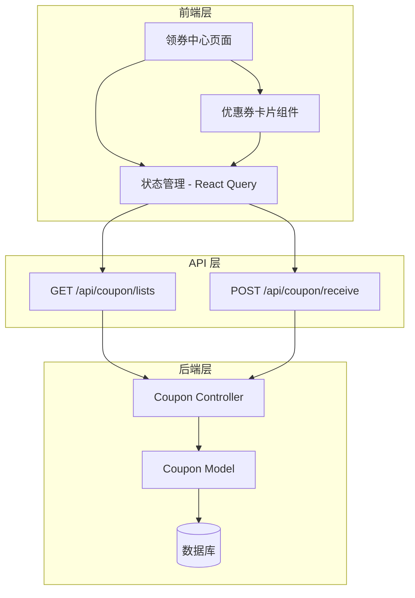
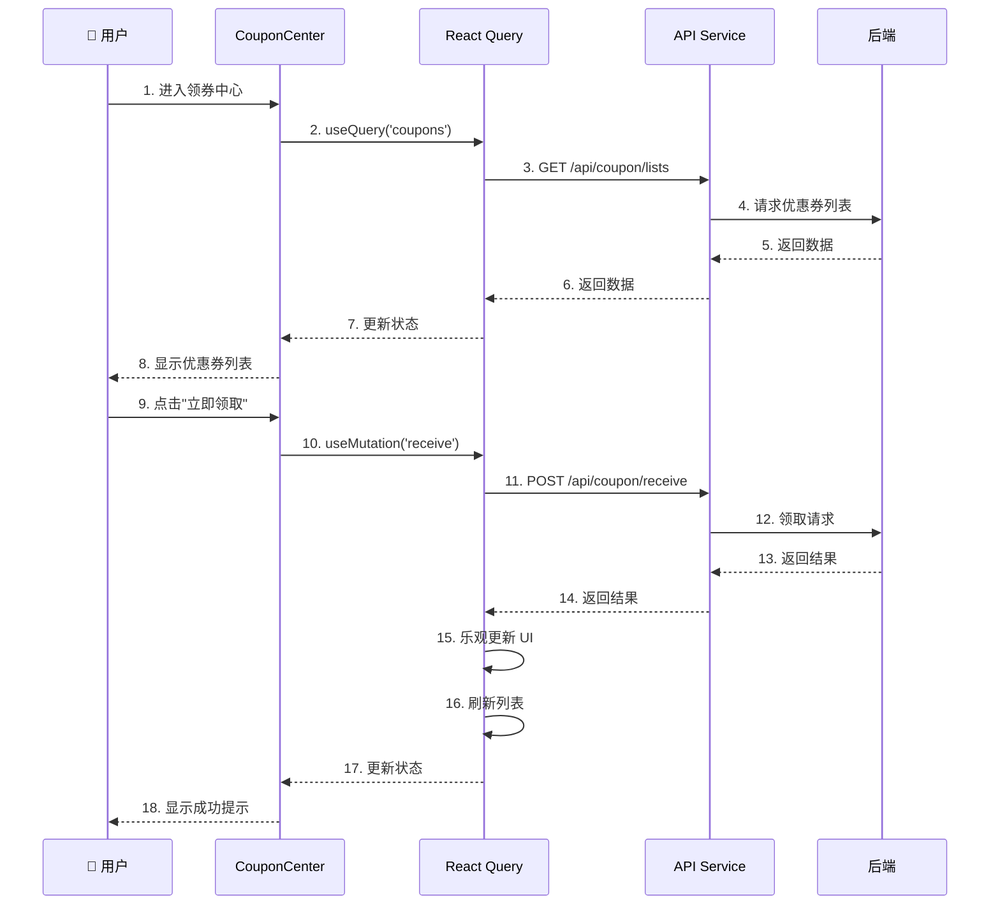
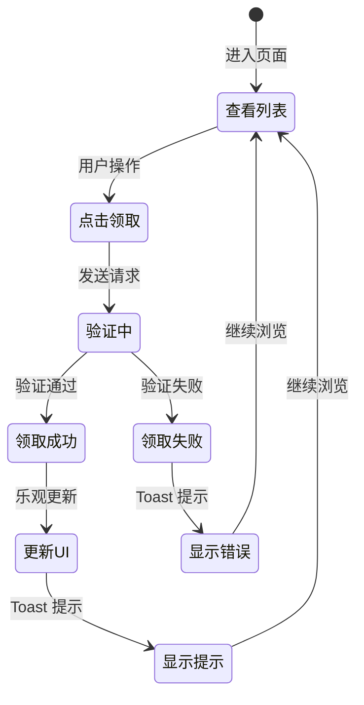
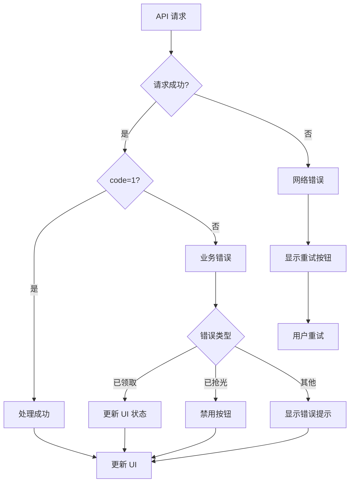

# Phase 5: 设计文档 (Design)

## 📋 文档信息
- **创建时间**: 2026-01-16
- **Phase**: 5 - Design
- **状态**: 进行中
- **基于**: requirements.md, clarification.md, data-model.md

---

## 🎯 1. 设计概览

### 1.1 功能范围
本设计文档涵盖优惠券领取功能的前端实现，包括：
- 领券中心页面（优惠券列表展示）
- 优惠券卡片组件
- 领取优惠券交互
- 状态管理和数据流
- 错误处理和用户反馈

### 1.2 设计原则
- **简洁性**: 用户能在 30 秒内完成领取操作
- **一致性**: 与现有 UI 风格保持一致（圆角卡片、渐变色）
- **响应性**: 列表加载 < 2 秒，领取响应 < 1 秒
- **可靠性**: 防止重复领取，处理并发场景
- **可访问性**: 清晰的状态提示和错误信息

---

## 🏗️ 2. 架构设计

### 2.1 系统架构图



### 2.2 技术栈

| 层级 | 技术 | 用途 |
|------|------|------|
| **UI 框架** | React 18 | 组件化开发 |
| **构建工具** | Vite | 快速开发和构建 |
| **样式** | Tailwind CSS | 原子化 CSS，渐变色 |
| **状态管理** | React Query (TanStack Query) | 服务端状态管理、缓存 |
| **HTTP 客户端** | Axios | API 请求封装 |
| **路由** | React Router | 页面导航 |
| **图标** | Lucide React | 图标库 |

---

## 📐 3. 组件设计

### 3.1 组件层次结构

```
CouponCenter (页面)
├── CouponList (列表容器)
│   ├── CouponCard (优惠券卡片) × N
│   │   ├── CouponBadge (颜色徽章)
│   │   ├── CouponInfo (优惠信息)
│   │   └── ReceiveButton (领取按钮)
│   └── EmptyState (空状态)
└── LoadingState (加载状态)
```

### 3.2 组件详细设计

#### 3.2.1 CouponCenter (页面组件)

**职责**: 
- 管理优惠券列表数据
- 处理加载、错误、空状态
- 提供下拉刷新功能

**Props**: 无

**State**:
```typescript
interface CouponCenterState {
  coupons: Coupon[];
  isLoading: boolean;
  error: Error | null;
}
```

**API 调用**:
- `GET /api/coupon/lists` - 获取优惠券列表

**文件路径**: `src/pages/Coupon/Center.jsx`

---

#### 3.2.2 CouponCard (优惠券卡片组件)

**职责**:
- 展示单个优惠券信息
- 处理领取按钮点击
- 显示领取状态

**Props**:
```typescript
interface CouponCardProps {
  coupon: {
    coupon_id: number;
    name: string;
    color: { value: 10 | 20 | 30 | 40 };
    coupon_type: { text: string; value: 10 | 20 };
    reduce_price: string;
    discount: number;
    min_price: string;
    expire_type: 10 | 20;
    expire_day: number;
    start_time: { text: string; value: number };
    end_time: { text: string; value: number };
    is_receive: boolean;
    state: { value: 0 | 1 };
  };
  onReceive: (couponId: number) => Promise<void>;
}
```

**UI 规范**:
- 圆角: `rounded-2xl`
- 阴影: `shadow-md hover:shadow-lg`
- 渐变背景（根据 color.value）:
  - 10 (blue): `bg-gradient-to-br from-blue-500 to-blue-600`
  - 20 (red): `bg-gradient-to-br from-red-500 to-red-600`
  - 30 (violet): `bg-gradient-to-br from-purple-500 to-purple-600`
  - 40 (yellow): `bg-gradient-to-br from-yellow-500 to-yellow-600`

**文件路径**: `src/components/Coupon/CouponCard.jsx`

---

#### 3.2.3 ReceiveButton (领取按钮组件)

**职责**:
- 显示按钮状态（可领取、已领取、已抢光）
- 处理点击事件
- 显示加载状态

**Props**:
```typescript
interface ReceiveButtonProps {
  isReceived: boolean;
  canReceive: boolean;
  isLoading: boolean;
  onClick: () => void;
}
```

**状态映射**:
| 条件 | 按钮文本 | 样式 | 可点击 |
|------|---------|------|--------|
| `isReceived=true` | "已领取" | 灰色 | 否 |
| `canReceive=false` | "已抢光" | 灰色 | 否 |
| `canReceive=true` | "立即领取" | 渐变色 | 是 |
| `isLoading=true` | "领取中..." | 渐变色 | 否 |

**文件路径**: `src/components/Coupon/ReceiveButton.jsx`

---

## 🔄 4. 数据流设计

### 4.1 数据流图



### 4.2 状态管理策略

#### 使用 React Query

**优势**:
- 自动缓存和重新验证
- 乐观更新支持
- 自动重试和错误处理
- 减少样板代码

**配置**:
```javascript
// src/hooks/useCoupons.js
import { useQuery, useMutation, useQueryClient } from '@tanstack/react-query';
import { getCouponList, receiveCoupon } from '@/api/coupon';

export const useCoupons = () => {
  return useQuery({
    queryKey: ['coupons'],
    queryFn: getCouponList,
    staleTime: 5 * 60 * 1000, // 5 分钟
    cacheTime: 10 * 60 * 1000, // 10 分钟
  });
};

export const useReceiveCoupon = () => {
  const queryClient = useQueryClient();
  
  return useMutation({
    mutationFn: receiveCoupon,
    onMutate: async (couponId) => {
      // 乐观更新
      await queryClient.cancelQueries(['coupons']);
      const previousCoupons = queryClient.getQueryData(['coupons']);
      
      queryClient.setQueryData(['coupons'], (old) => ({
        ...old,
        list: old.list.map(c => 
          c.coupon_id === couponId 
            ? { ...c, is_receive: true, state: { value: 0 } }
            : c
        )
      }));
      
      return { previousCoupons };
    },
    onError: (err, couponId, context) => {
      // 回滚
      queryClient.setQueryData(['coupons'], context.previousCoupons);
    },
    onSuccess: () => {
      // 刷新列表
      queryClient.invalidateQueries(['coupons']);
    }
  });
};
```

---

## 🎨 5. UI/UX 设计

### 5.1 页面布局

```
┌─────────────────────────────────┐
│  ← 领券中心                      │  ← Header
├─────────────────────────────────┤
│                                 │
│  ┌───────────────────────────┐ │
│  │ 🎫 满100减10              │ │  ← 优惠券卡片
│  │ 运费券                    │ │
│  │ 满100元可用               │ │
│  │ 领取后7天内有效           │ │
│  │              [立即领取]   │ │
│  └───────────────────────────┘ │
│                                 │
│  ┌───────────────────────────┐ │
│  │ 🎫 满200减30              │ │
│  │ 运费券                    │ │
│  │ 满200元可用               │ │
│  │ 领取后7天内有效           │ │
│  │              [已领取]     │ │
│  └───────────────────────────┘ │
│                                 │
└─────────────────────────────────┘
```

### 5.2 优惠券卡片设计

**布局结构**:
```html
<div class="rounded-2xl shadow-md p-4 bg-gradient-to-br from-blue-500 to-blue-600">
  <!-- 左侧：优惠信息 -->
  <div class="flex-1">
    <div class="text-white text-2xl font-bold">¥10</div>
    <div class="text-white/80 text-sm">满¥100可用</div>
  </div>
  
  <!-- 右侧：详细信息 -->
  <div class="flex-1">
    <div class="text-white font-medium">满100减10</div>
    <div class="text-white/70 text-xs">运费券</div>
    <div class="text-white/70 text-xs">领取后7天内有效</div>
  </div>
  
  <!-- 领取按钮 -->
  <button class="bg-white text-blue-600 rounded-lg px-4 py-2">
    立即领取
  </button>
</div>
```

### 5.3 颜色方案

| 优惠券颜色 | color.value | Tailwind 类 | 用途 |
|-----------|-------------|-------------|------|
| 蓝色 | 10 | `from-blue-500 to-blue-600` | 通用优惠券 |
| 红色 | 20 | `from-red-500 to-red-600` | 高价值优惠券 |
| 紫色 | 30 | `from-purple-500 to-purple-600` | 特殊优惠券 |
| 黄色 | 40 | `from-yellow-500 to-yellow-600` | 限时优惠券 |

### 5.4 交互设计

#### 5.4.1 领取流程



#### 5.4.2 用户反馈

| 场景 | 反馈方式 | 持续时间 | 样式 |
|------|---------|---------|------|
| 领取成功 | Toast 提示 | 2 秒 | 绿色，带勾选图标 |
| 领取失败 | Toast 提示 | 3 秒 | 红色，带错误图标 |
| 已领取 | 按钮禁用 | - | 灰色背景 |
| 已抢光 | 按钮禁用 | - | 灰色背景 |
| 加载中 | 骨架屏 | - | 灰色动画 |

---

## 🔌 6. API 集成设计

### 6.1 API 服务封装

**文件路径**: `src/api/coupon.js`

```javascript
import request from '@/utils/request';

/**
 * 获取优惠券列表
 * @returns {Promise<{code: number, msg: string, data: {list: Coupon[]}}>}
 */
export const getCouponList = () => {
  return request({
    url: '/api/coupon/lists',
    method: 'GET',
    params: {
      wxapp_id: 10001
    }
  });
};

/**
 * 领取优惠券
 * @param {number} couponId - 优惠券ID
 * @returns {Promise<{code: number, msg: string, data: any}>}
 */
export const receiveCoupon = (couponId) => {
  return request({
    url: '/api/coupon/receive',
    method: 'POST',
    data: {
      coupon_id: couponId,
      wxapp_id: 10001
    }
  });
};
```

### 6.2 请求/响应处理

#### 6.2.1 成功响应处理

```javascript
// 列表响应
{
  code: 1,
  msg: "success",
  data: {
    list: [
      {
        coupon_id: 1,
        name: "满100减10",
        color: { value: 10 },
        reduce_price: "10.00",
        min_price: "100.00",
        is_receive: false,
        state: { value: 1 }
      }
    ]
  }
}

// 领取响应
{
  code: 1,
  msg: "领取成功",
  data: []
}
```

#### 6.2.2 错误响应处理

```javascript
// 错误响应
{
  code: 0,
  msg: "优惠券已发完" | "该优惠券已领取" | "优惠券已过期"
}

// 错误处理逻辑
const handleReceiveError = (error) => {
  const errorMessages = {
    '优惠券已发完': '很抱歉，优惠券已被领完',
    '该优惠券已领取': '您已经领取过该优惠券',
    '优惠券已过期': '该优惠券已过期',
    'default': '领取失败，请稍后重试'
  };
  
  const message = errorMessages[error.msg] || errorMessages.default;
  showToast(message, 'error');
};
```

---

## ⚠️ 7. 错误处理设计

### 7.1 错误分类

| 错误类型 | 场景 | 处理策略 |
|---------|------|---------|
| **网络错误** | 请求超时、无网络 | 显示重试按钮 |
| **业务错误** | 优惠券已领完、已领取 | 显示错误提示，禁用按钮 |
| **系统错误** | 服务器 500 | 显示通用错误提示 |
| **并发错误** | 同时领取多张 | 队列处理，逐个领取 |

### 7.2 错误处理流程



### 7.3 错误提示文案

| 错误码 | 后端消息 | 前端显示（中文） | 前端显示（泰语） |
|-------|---------|----------------|----------------|
| 0 | 优惠券已发完 | 很抱歉，优惠券已被领完 | ขออภัย คูปองหมดแล้ว |
| 0 | 该优惠券已领取 | 您已经领取过该优惠券 | คุณได้รับคูปองนี้แล้ว |
| 0 | 优惠券已过期 | 该优惠券已过期 | คูปองหมดอายุแล้ว |
| - | 网络错误 | 网络连接失败，请重试 | การเชื่อมต่อล้มเหลว โปรดลองอีกครั้ง |

---

## 🧪 8. 测试策略

### 8.1 单元测试

**测试文件**: `src/components/Coupon/__tests__/CouponCard.test.jsx`

**测试用例**:
```javascript
describe('CouponCard', () => {
  it('应该正确显示优惠券信息', () => {
    // 测试优惠券名称、金额、限制条件显示
  });
  
  it('已领取的优惠券应该禁用按钮', () => {
    // 测试 is_receive=true 时按钮状态
  });
  
  it('点击领取按钮应该调用 onReceive', () => {
    // 测试点击事件
  });
  
  it('应该根据 color.value 显示正确的渐变色', () => {
    // 测试颜色映射
  });
});
```

### 8.2 集成测试

**测试场景**:
1. 加载优惠券列表
2. 领取优惠券成功
3. 领取优惠券失败（已领取）
4. 领取优惠券失败（已抢光）
5. 网络错误重试

### 8.3 E2E 测试

**测试流程**:
```gherkin
场景：用户成功领取优惠券
  假设 用户已登录
  当 用户进入领券中心
  那么 应该看到优惠券列表
  当 用户点击"立即领取"按钮
  那么 按钮应该显示"领取中..."
  并且 1秒后按钮应该变为"已领取"
  并且 应该显示"领取成功"提示
```

---

## 🚀 9. 性能优化

### 9.1 优化策略

| 优化项 | 策略 | 预期效果 |
|-------|------|---------|
| **列表渲染** | 虚拟滚动（如果列表 > 50 项） | 减少 DOM 节点 |
| **图片加载** | 懒加载 | 减少初始加载时间 |
| **API 缓存** | React Query 缓存 5 分钟 | 减少重复请求 |
| **乐观更新** | 立即更新 UI，后台同步 | 提升用户体验 |
| **防抖** | 领取按钮防抖 500ms | 防止重复点击 |

### 9.2 性能指标

| 指标 | 目标 | 测量方法 |
|------|------|---------|
| 首屏加载时间 | < 2 秒 | Lighthouse |
| 领取响应时间 | < 1 秒 | Network 面板 |
| 列表滚动 FPS | ≥ 60 | Performance 面板 |
| 内存占用 | < 50 MB | Memory 面板 |

---

## 📱 10. 响应式设计

### 10.1 断点设计

| 设备 | 宽度 | 布局 |
|------|------|------|
| 手机 | < 640px | 单列，卡片全宽 |
| 平板 | 640px - 1024px | 双列 |
| 桌面 | > 1024px | 三列 |

### 10.2 适配策略

```css
/* 手机 */
.coupon-card {
  @apply w-full;
}

/* 平板 */
@media (min-width: 640px) {
  .coupon-card {
    @apply w-1/2;
  }
}

/* 桌面 */
@media (min-width: 1024px) {
  .coupon-card {
    @apply w-1/3;
  }
}
```

---

## 🔐 11. 安全设计

### 11.1 安全措施

| 安全项 | 实现方式 |
|-------|---------|
| **身份验证** | 请求头携带 token |
| **防重放攻击** | 请求时间戳 + nonce |
| **防刷机制** | 前端防抖 + 后端限流 |
| **XSS 防护** | React 自动转义 |
| **CSRF 防护** | Token 验证 |

### 11.2 Token 管理

```javascript
// src/utils/request.js
import axios from 'axios';

const request = axios.create({
  baseURL: import.meta.env.VITE_API_BASE_URL,
  timeout: 10000
});

// 请求拦截器
request.interceptors.request.use(config => {
  const token = localStorage.getItem('token');
  if (token) {
    config.headers['token'] = token;
  }
  return config;
});

// 响应拦截器
request.interceptors.response.use(
  response => response.data,
  error => {
    if (error.response?.status === 401) {
      // Token 过期，跳转登录
      window.location.href = '/login';
    }
    return Promise.reject(error);
  }
);
```

---

## 📋 12. 实现清单

### 12.1 开发任务

- [ ] **Phase 1: 基础组件**
  - [ ] 创建 CouponCard 组件
  - [ ] 创建 ReceiveButton 组件
  - [ ] 创建 EmptyState 组件
  - [ ] 创建 LoadingState 组件

- [ ] **Phase 2: 页面开发**
  - [ ] 创建 CouponCenter 页面
  - [ ] 集成 React Query
  - [ ] 实现列表渲染
  - [ ] 实现下拉刷新

- [ ] **Phase 3: API 集成**
  - [ ] 封装 API 服务
  - [ ] 实现数据获取
  - [ ] 实现领取功能
  - [ ] 实现错误处理

- [ ] **Phase 4: 优化和测试**
  - [ ] 添加乐观更新
  - [ ] 添加防抖处理
  - [ ] 编写单元测试
  - [ ] 编写集成测试

- [ ] **Phase 5: 国际化**
  - [ ] 添加泰语翻译
  - [ ] 添加中文翻译
  - [ ] 测试多语言切换

### 12.2 验收标准

- [ ] 优惠券列表正确显示
- [ ] 领取按钮状态正确
- [ ] 领取成功后 UI 更新
- [ ] 错误提示清晰明确
- [ ] 性能指标达标
- [ ] 通过所有测试用例

---

## 📚 13. 参考资料

### 13.1 相关文档
- `requirements.md` - 需求分析文档
- `clarification.md` - 澄清文档
- `data-model.md` - 数据模型文档
- `test-report.md` - API 测试报告

### 13.2 参考组件
- `src/components/Grade/GradeBadge.jsx` - 渐变徽章样式参考
- `src/pages/Grade/Index.jsx` - 页面结构参考
- `src/components/Order/EnhancedOrderCard.jsx` - 卡片组件参考

### 13.3 技术文档
- [React Query 文档](https://tanstack.com/query/latest)
- [Tailwind CSS 文档](https://tailwindcss.com/docs)
- [Axios 文档](https://axios-http.com/docs/intro)

---

## 🎯 14. 下一步

- [ ] 进入 Phase 6：实现（Implementation）
- [ ] 或者如果需要迭代：返回 Phase 4/5 并更新设计

---

**设计完成日期**: 2026-01-16
**设计审核**: 待审核
**实现开始日期**: 待定
