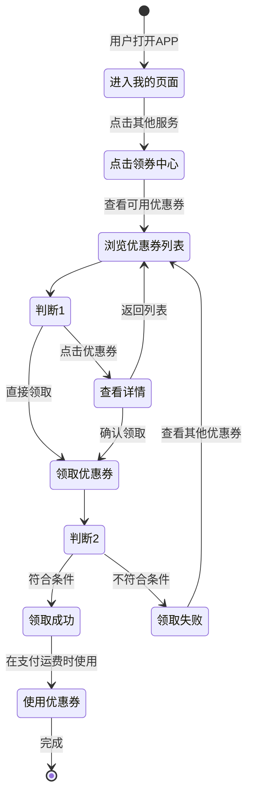

# 需求分析：优惠券领取功能

**创建日期**：2026-01-16
**状态**：进行中

---

## 1. 用户角色

| 角色 | 描述 | 主要目标 |
|------|------|----------|
| 普通用户 | 使用集运服务的终端用户 | 领取优惠券以降低运费成本 |
| 后台管理员 | 系统管理人员 | 配置和管理优惠券规则 |

---

## 2. 核心用户活动流程

### 活动图




### 活动详情

| 活动 | 描述 | 输入 | 输出 | 参与者 |
|------|------|------|------|--------|
| **进入我的页面** | 用户打开APP并进入个人中心 | 用户登录状态 | 我的页面界面 | 用户 |
| **点击领券中心** | 在其他服务区域点击优惠券入口 | 页面交互 | 领券中心页面 | 用户 |
| **浏览优惠券列表** | 查看所有可领取的优惠券 | 用户ID、优惠券规则 | 优惠券列表 | 用户、系统 |
| **查看详情** | 查看优惠券的详细信息 | 优惠券ID | 优惠券详情 | 用户、系统 |
| **领取优惠券** | 用户点击领取按钮 | 用户ID、优惠券ID | 领取结果 | 用户、系统 |
| **使用优惠券** | 在支付运费时选择使用 | 订单信息、优惠券 | 折扣后金额 | 用户、系统 |

---

## 3. 用户故事地图

### 发布规划

| 活动 | MVP | v1.1 | v2.0 |
|------|-----|------|------|
| **浏览优惠券** | US-001, US-002 | US-003 | - |
| **领取优惠券** | US-004, US-005 | US-006 | - |
| **使用优惠券** | - | US-007 | US-008 |

---

## 4. 用户故事

### 活动1：浏览优惠券

#### US-001：查看优惠券列表

**优先级**：P0
**角色**：普通用户
**发布版本**：MVP

**用户故事**：
> 作为一名普通用户，
> 我想要在领券中心查看所有可领取的优惠券，
> 以便我可以了解有哪些优惠可以使用。

**验收标准**：

```gherkin
场景：用户进入领券中心
  假设 用户已登录系统
  当 用户点击"我的"页面中的"领券中心"入口
  那么 系统应该显示所有公开的优惠券列表
  并且 每个优惠券应该显示名称、优惠额度、使用限制
```

**INVEST检查**：
- [x] **I**ndependent - 独立功能
- [x] **N**egotiable - 可协商细节
- [x] **V**aluable - 为用户提供价值
- [x] **E**stimable - 可估算工作量
- [x] **S**mall - 适合一个迭代
- [x] **T**estable - 可测试


#### US-002：查看优惠券详细信息

**优先级**：P0
**角色**：普通用户
**发布版本**：MVP

**用户故事**：
> 作为一名普通用户，
> 我想要清晰地看到每个优惠券的优惠额度、使用限制和优惠券名称，
> 以便我可以判断该优惠券是否适合我使用。

**验收标准**：

```gherkin
场景：显示优惠券信息
  假设 用户在领券中心页面
  当 系统显示优惠券列表
  那么 每个优惠券卡片应该包含以下信息：
    | 字段 | 示例 |
    | 优惠券名称 | 满100减10优惠券 |
    | 优惠额度 | 减免10元 |
    | 使用限制 | 满100元可用 |
    | 有效期 | 领取后7天内有效 |
  并且 信息应该清晰易读
```

**INVEST检查**：
- [x] **I**ndependent
- [x] **N**egotiable
- [x] **V**aluable
- [x] **E**stimable
- [x] **S**mall
- [x] **T**estable

---

#### US-003：优惠券颜色区分

**优先级**：P1
**角色**：普通用户
**发布版本**：v1.1

**用户故事**：
> 作为一名普通用户，
> 我想要通过不同颜色快速识别不同类型的优惠券，
> 以便我可以更快地找到我需要的优惠券。

**验收标准**：

```gherkin
场景：优惠券颜色显示
  假设 后台配置了优惠券颜色
  当 用户查看优惠券列表
  那么 每个优惠券应该按照后台配置的颜色显示
  并且 颜色应该与优惠券类型相匹配
```

**INVEST检查**：
- [x] **I**ndependent
- [x] **N**egotiable
- [x] **V**aluable
- [x] **E**stimable
- [x] **S**mall
- [x] **T**estable


### 活动2：领取优惠券

#### US-004：领取优惠券

**优先级**：P0
**角色**：普通用户
**发布版本**：MVP

**用户故事**：
> 作为一名普通用户，
> 我想要点击按钮领取优惠券，
> 以便我可以在支付运费时使用该优惠券。

**验收标准**：

```gherkin
场景：成功领取优惠券
  假设 用户在领券中心页面
  并且 用户符合优惠券的领取条件
  并且 优惠券库存充足
  当 用户点击"立即领取"按钮
  那么 系统应该将优惠券发放到用户账户
  并且 显示"领取成功"提示
  并且 按钮状态变为"已领取"

场景：优惠券已领完
  假设 用户在领券中心页面
  并且 优惠券已达到发放总数量限制
  当 用户尝试领取
  那么 系统应该显示"优惠券已领完"提示
  并且 按钮状态为不可点击

场景：超过领取数量限制
  假设 用户已领取该优惠券
  并且 已达到单用户领取数量限制
  当 用户尝试再次领取
  那么 系统应该显示"已达到领取上限"提示
```

**INVEST检查**：
- [x] **I**ndependent
- [x] **N**egotiable
- [x] **V**aluable
- [x] **E**stimable
- [x] **S**mall
- [x] **T**estable

---

#### US-005：优惠券领取规则验证

**优先级**：P0
**角色**：系统
**发布版本**：MVP

**用户故事**：
> 作为系统，
> 我需要根据后台配置的规则验证用户是否符合领取条件，
> 以便确保优惠券按照预期规则发放。

**验收标准**：

```gherkin
场景：验证领取规则
  假设 后台配置了优惠券领取规则
  当 用户尝试领取优惠券
  那么 系统应该验证以下条件：
    | 规则 | 验证内容 |
    | 是否公开 | 优惠券是否公开到领券中心 |
    | 库存数量 | 是否还有剩余数量 |
    | 领取限制 | 用户是否超过领取数量限制 |
    | 有效期 | 优惠券是否在有效期内 |
  并且 只有所有条件都满足时才允许领取
```

**INVEST检查**：
- [x] **I**ndependent
- [x] **N**egotiable
- [x] **V**aluable
- [x] **E**stimable
- [x] **S**mall
- [x] **T**estable

