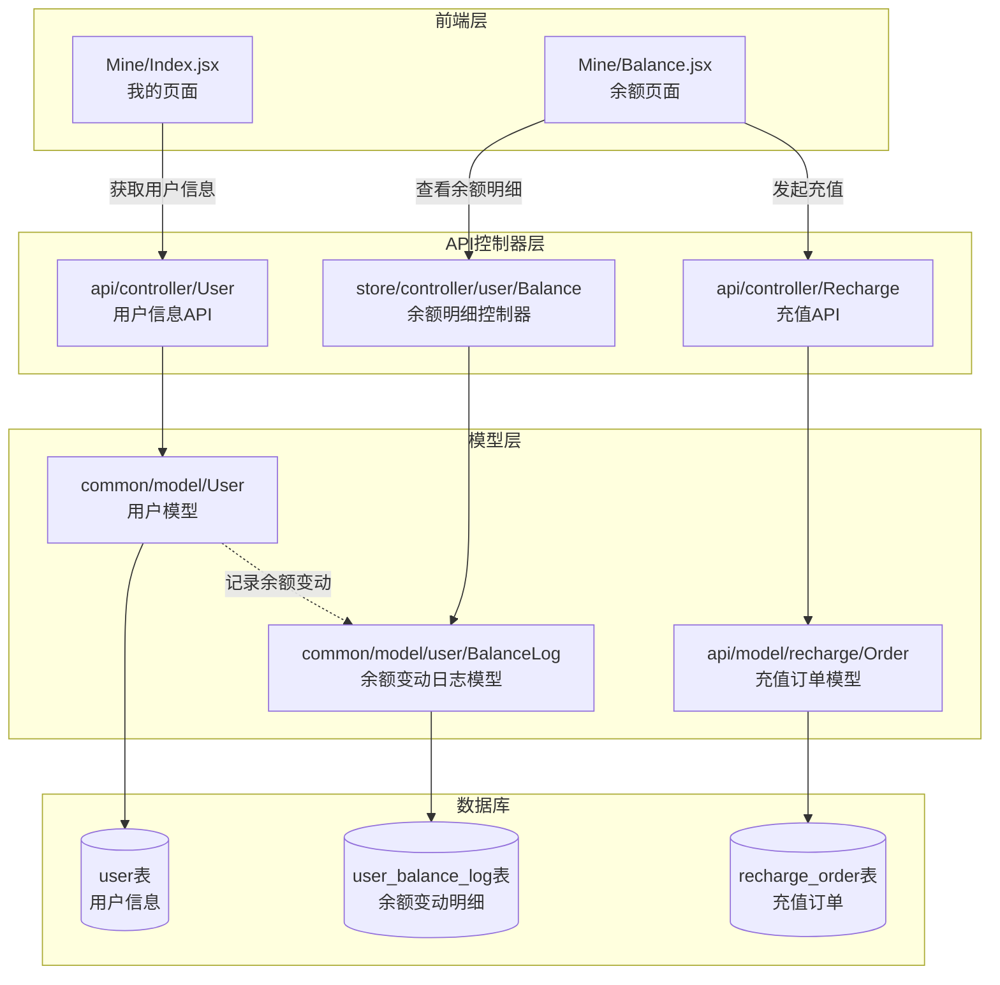
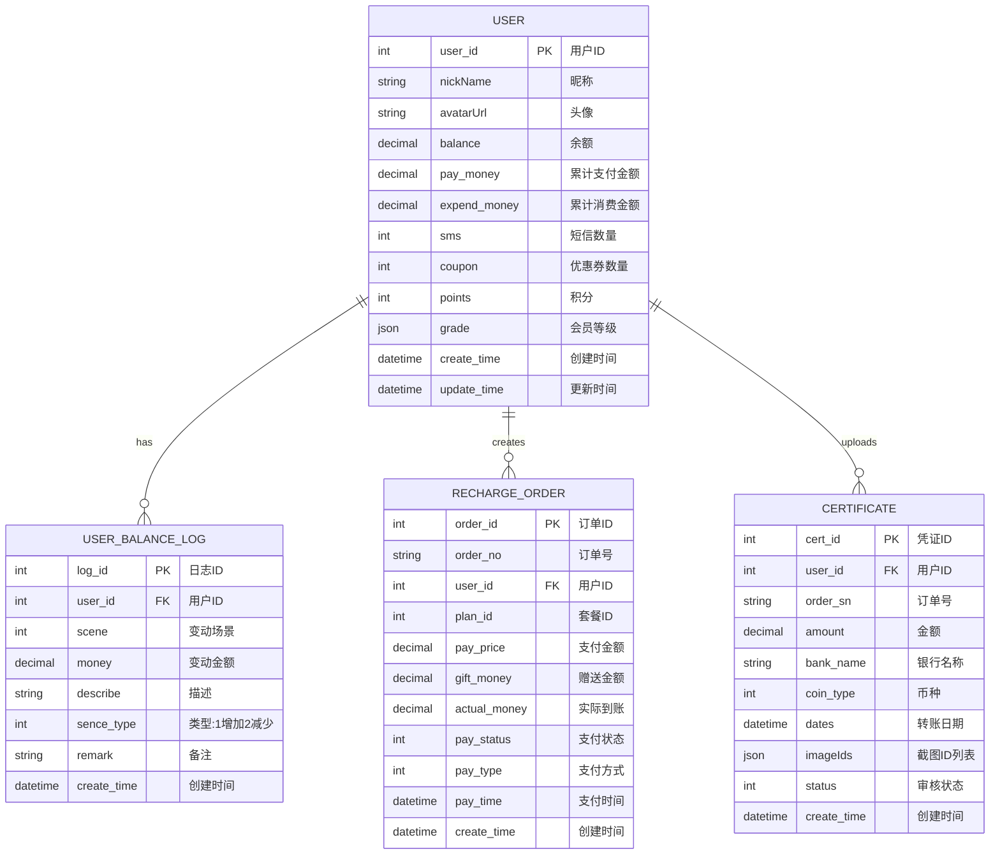

# 钱包余额显示功能 - 逆向工程报告

## 1. 项目概述

**项目**: LINE Mini App 集运系统
**分析日期**: 2026-01-16
**分析范围**: 用户余额管理、充值记录、余额明细、折扣记录功能
**分析目标**: 提取现有后端实现的需求，并补充前端"我的"页面余额显示需求

## 2. 技术栈

| 类别 | 技术 |
|------|------|
| 后端语言 | PHP (ThinkPHP 5.x) |
| 前端语言 | JavaScript (React) |
| 前端框架 | React + Vite + Tailwind CSS |
| 状态管理 | Recoil |
| 国际化 | react-i18next |
| 数据库 | MySQL |
| API风格 | RESTful |

## 3. 架构分析

### 后端架构



### 关键模式

- **MVC架构**: 控制器-模型-视图分离
- **RESTful API**: 前后端通过HTTP API通信
- **事务日志**: 所有余额变动都记录到 `user_balance_log` 表
- **枚举类型**: 使用 `SceneEnum` 管理余额变动场景

## 4. 数据模型



## 5. 功能清单

| 功能ID | 功能名称 | 代码位置 | 状态 |
|--------|---------|---------|------|
| F-001 | 用户余额查询 | `api/controller/User::detail` | ✅ 已实现 |
| F-002 | 余额变动日志 | `common/model/user/BalanceLog` | ✅ 已实现 |
| F-003 | 余额增加 | `common/model/User::banlanceUpdate('add')` | ✅ 已实现 |
| F-004 | 余额扣减 | `common/model/User::banlanceUpdate('remove')` | ✅ 已实现 |
| F-005 | 在线充值 | `api/controller/Recharge::submit` | ✅ 已实现 |
| F-006 | 转账充值申请 | `api/controller/Recharge::apply` | ✅ 已实现 |
| F-007 | 充值订单管理 | `api/model/recharge/Order` | ✅ 已实现 |
| F-008 | 前端余额显示 | `src/pages/Mine/Index.jsx` | ⚠️ 部分实现 |
| F-009 | 余额详情页面 | `src/pages/Mine/Balance.jsx` | ⚠️ 静态页面 |
| F-010 | 充值-付款记录 | - | ❌ 未实现 |

## 6. 提取的需求

### 功能需求

#### REQ-001: 用户余额查询

**来源**: F-001, `api/controller/User::detail`
**类型**: 功能需求
**优先级**: 高 (Must Have)

**描述**:
系统应提供API接口，允许已登录用户查询自己的当前余额。余额信息包含在用户详情接口中返回。

**证据**:
- 文件: `Lineminiapp/source/application/api/controller/User.php`
- 文件: `zalo_mini_app-master/src/pages/Mine/Index.jsx:fetchUserAssets()`
- 行为: 前端调用 `user/detail` 接口获取用户信息，包含 `balance` 字段

**验收标准** (从代码推断):
- [x] 用户必须已登录才能查询余额
- [x] 返回的余额字段为 `balance`，类型为数字
- [x] 余额精度为小数点后2位
- [x] 未登录用户返回错误码 -1

**注意事项**:
- 当前前端显示的余额是硬编码的 `200.00`，需要改为从API获取的真实余额

---

#### REQ-002: 余额变动日志记录

**来源**: F-002, `common/model/user/BalanceLog`
**类型**: 功能需求
**优先级**: 高 (Must Have)

**描述**:
系统应记录所有余额变动操作，包括充值、消费、退款等场景。每条记录包含变动金额、变动类型、场景描述、操作时间等信息。

**证据**:
- 文件: `Lineminiapp/source/application/common/model/user/BalanceLog.php`
- 表: `user_balance_log`
- 行为: 每次调用 `User::banlanceUpdate()` 时自动创建日志记录

**验收标准** (从代码推断):
- [x] 余额增加时记录类型为 1
- [x] 余额减少时记录类型为 2
- [x] 记录包含用户ID、金额、场景、描述、备注
- [x] 使用 `SceneEnum` 枚举管理场景类型
- [x] 自动记录创建时间

---

#### REQ-003: 余额增加操作

**来源**: F-003, `common/model/User::banlanceUpdate('add')`
**类型**: 功能需求
**优先级**: 高 (Must Have)

**描述**:
系统应支持增加用户余额的操作，通常用于充值成功后的余额到账。操作应同时更新用户余额并记录变动日志。

**证据**:
- 文件: `Lineminiapp/source/application/common/model/User.php:banlanceUpdate()`
- 行为: 
  ```php
  $update['balance'] = $member['balance'] + $amount;
  BalanceLog::add(SceneEnum::CONSUME, [...]);
  ```

**验收标准** (从代码推断):
- [x] 余额增加金额必须大于0
- [x] 更新用户表的 `balance` 字段
- [x] 同时创建余额变动日志
- [x] 操作应在事务中执行，保证数据一致性

---

#### REQ-004: 余额扣减操作

**来源**: F-004, `common/model/User::banlanceUpdate('remove')`
**类型**: 功能需求
**优先级**: 高 (Must Have)

**描述**:
系统应支持扣减用户余额的操作，通常用于订单支付。操作应同时更新用户余额、累计支付金额，并记录变动日志。

**证据**:
- 文件: `Lineminiapp/source/application/common/model/User.php:banlanceUpdate()`
- 行为:
  ```php
  $update['balance'] = $member['balance'] - $amount;
  $update['pay_money'] = $member['pay_money'] + $amount;
  BalanceLog::add(SceneEnum::CONSUME, [...]);
  ```

**验收标准** (从代码推断):
- [x] 扣减金额必须大于0
- [x] 扣减后余额不能为负数
- [x] 更新用户表的 `balance` 和 `pay_money` 字段
- [x] 同时创建余额变动日志
- [x] 操作应在事务中执行

---

#### REQ-005: 在线充值

**来源**: F-005, `api/controller/Recharge::submit`
**类型**: 功能需求
**优先级**: 高 (Must Have)

**描述**:
系统应支持用户通过第三方支付平台（微信支付、汉特支付）进行在线充值。用户可以选择充值套餐或自定义充值金额。

**证据**:
- 文件: `Lineminiapp/source/application/api/controller/Recharge.php:submit()`
- 行为: 创建充值订单 → 调用支付服务 → 返回支付参数

**验收标准** (从代码推断):
- [x] 支持选择充值套餐或自定义金额
- [x] 支持多种支付方式（微信、汉特支付）
- [x] 创建充值订单记录
- [x] 返回支付参数供前端调起支付
- [x] 支付成功后自动到账

---

#### REQ-006: 转账充值申请

**来源**: F-006, `api/controller/Recharge::apply`
**类型**: 功能需求
**优先级**: 中 (Should Have)

**描述**:
系统应支持用户通过银行转账方式充值。用户需要上传转账截图、填写转账日期时间和金额，提交后等待管理员审核。

**证据**:
- 文件: `Lineminiapp/source/application/api/controller/Recharge.php:apply()`
- 行为: 上传截图 → 创建凭证记录 → 等待审核

**验收标准** (从代码推断):
- [x] 必填字段：转账日期、转账时间、充值金额、转账截图
- [x] 支持上传多张截图（Base64格式）
- [x] 截图自动上传到云存储
- [x] 使用 Certificate 模型保存凭证
- [x] 提交后状态为"待审核"

---

#### REQ-007: 前端"我的"页面显示余额

**来源**: F-008, `src/pages/Mine/Index.jsx`
**类型**: 功能需求
**优先级**: 高 (Must Have)

**描述**:
在前端"我的"页面顶部资产卡片中显示用户的最新余额。用户点击余额数字可以跳转到余额详情页面。

**证据**:
- 文件: `zalo_mini_app-master/src/pages/Mine/Index.jsx`
- 当前状态: 显示硬编码的余额值，未从API获取

**验收标准** (推断):
- [ ] 页面加载时自动获取用户余额
- [ ] 显示格式：保留2位小数
- [ ] 显示币种：VNĐ（越南盾）或 THB（泰铢）
- [ ] 点击余额可跳转到余额详情页
- [ ] 未登录时不显示余额信息

**注意事项**:
- [需要实现] 当前余额是硬编码的 `200.00`，需要改为从 `fetchUserAssets()` 获取的真实数据

---

#### REQ-008: 余额详情页面

**来源**: F-009, `src/pages/Mine/Balance.jsx`
**类型**: 功能需求
**优先级**: 高 (Must Have)

**描述**:
提供余额详情页面，显示当前余额，并提供充值入口和余额相关功能菜单（账户明细、银行账户、上传凭证、付款历史）。

**证据**:
- 文件: `zalo_mini_app-master/src/pages/Mine/Balance.jsx`
- 当前状态: 静态页面，余额硬编码为 `200.00`

**验收标准** (推断):
- [ ] 显示当前余额（从API获取）
- [ ] 提供"充值"按钮，跳转到充值页面
- [ ] 提供"账户明细"入口，查看余额变动记录
- [ ] 提供"银行账户"入口
- [ ] 提供"上传凭证"入口，用于转账充值
- [ ] 提供"付款历史"入口，查看充值记录

**注意事项**:
- [需要实现] 当前余额是硬编码的，需要从API获取
- [需要实现] 各个菜单项的目标页面需要开发

---

#### REQ-009: 充值-付款记录页面

**来源**: F-010, 用户需求
**类型**: 功能需求
**优先级**: 高 (Must Have)

**描述**:
提供充值和付款记录页面，展示用户的所有余额变动记录，包括充值记录（增加）和付款记录（减少）。支持按类型筛选和时间排序。

**证据**:
- 后端支持: `store/controller/user/Balance::log()`
- 前端状态: 未实现

**验收标准** (推断):
- [ ] 显示余额变动列表
- [ ] 每条记录显示：时间、类型（充值/付款）、金额、余额、描述
- [ ] 充值记录显示为绿色/正数
- [ ] 付款记录显示为红色/负数
- [ ] 支持按类型筛选（全部/充值/付款）
- [ ] 按时间倒序排列（最新的在前）
- [ ] 支持分页加载

**注意事项**:
- [需要实现] 前端页面完全未开发
- [需要实现] 需要调用后端 `user/balance/log` 接口

---

### 非功能需求

#### NFR-001: 余额精度

**类型**: 非功能需求 - 数据精度
**优先级**: 高 (Must Have)

**描述**:
所有余额相关的金额字段必须使用 `decimal` 类型存储，精度为小数点后2位，避免浮点数精度问题。

**证据**:
- 数据库字段类型: `decimal(10,2)`
- 前端显示: 保留2位小数

---

#### NFR-002: 余额操作原子性

**类型**: 非功能需求 - 数据一致性
**优先级**: 高 (Must Have)

**描述**:
所有余额变动操作（增加/扣减）必须在数据库事务中执行，确保余额更新和日志记录的原子性。

**证据**:
- 代码模式: 余额更新和日志记录在同一个方法中执行

---

#### NFR-003: 余额查询性能

**类型**: 非功能需求 - 性能
**优先级**: 中 (Should Have)

**描述**:
用户余额查询接口响应时间应在 200ms 以内，余额变动日志查询支持分页，单页不超过 50 条记录。

---

## 7. 技术债务与已知问题

| ID | 类型 | 位置 | 描述 |
|----|------|------|------|
| TD-001 | 硬编码 | `src/pages/Mine/Index.jsx:217` | 余额显示硬编码为 200.00 |
| TD-002 | 硬编码 | `src/pages/Mine/Balance.jsx:48` | 余额显示硬编码为 200.00 |
| TD-003 | 未实现 | `src/pages/Mine/Balance.jsx:14-27` | 菜单项路由未实现 |
| TD-004 | 命名不一致 | `common/model/User.php` | 方法名拼写错误 `banlanceUpdate` 应为 `balanceUpdate` |
| TD-005 | 缺少验证 | `common/model/User.php:banlanceUpdate` | 扣减余额时未检查余额是否充足 |

## 8. 需求澄清结果 ✅

经过与用户讨论，所有不确定性已澄清：

### 1. 币种 💰
**确认**: 使用 **泰铢（THB）**
- 前端显示需要从 VNĐ 改为 THB
- 后端 `coin_type=2` 正确表示泰铢

### 2. 页面结构 📱
**确认**: 参考截图的3入口设计
- **账单记录** = 所有余额变动（充值+消费）
- **消费记录** = 只显示余额扣减
- **充值记录** = 只显示余额增加
- **实现方式**: 一个页面，用Tab切换

### 3. 折扣记录 🎫
**确认**: 折扣记录 = 优惠券使用记录 + 会员折扣记录
- 这是一个新功能，需要开发
- 暂时不在MVP范围内

### 4. 累计数据 📊
**确认**: 
- **累计充值** = 历史所有充值金额总和
- **累计消费** = 历史所有消费金额总和
- 都需要从API获取

### 5. 功能入口 🗺️
**确认**: 只保留3个入口
- 账单记录
- 消费记录  
- 充值记录
- **上传凭证功能** 集成在充值页面内

### 6. 审核流程 ✅
**确认**: 审核功能已在后台实现
- 用户上传转账凭证后，后台管理员审核
- 审核通过后，管理员手动给用户余额充值
- 前端只需要显示凭证状态（待审核/已通过/已拒绝）

## 9. 实施计划

基于需求澄清，确定以下实施计划：

### Phase 1: 核心功能修复（高优先级）⭐

1. **修复前端余额显示**
   - 修改 `Mine/Index.jsx`：从API获取真实余额
   - 修改 `Mine/Balance.jsx`：从API获取真实余额
   - 币种改为 THB（泰铢）
   - 添加累计充值、累计消费显示

2. **重构余额详情页面**
   - 按照参考截图重新设计 `Balance.jsx`
   - 蓝色卡片：总资产、充值按钮、累计充值、累计消费
   - 3个入口：账单记录、消费记录、充值记录

3. **实现余额明细页面（Tab切换）**
   - 创建 `/mine/balance/log` 页面
   - 实现Tab切换：全部/充值/消费
   - 调用后端 `user/balance/log` 接口
   - 列表显示：时间、类型、金额、余额、描述

### Phase 2: 充值功能完善（高优先级）⭐

4. **完善充值页面**
   - 在线充值（已有）
   - 集成转账充值（上传凭证）功能
   - 显示充值历史

5. **转账凭证状态显示**
   - 显示凭证审核状态（待审核/已通过/已拒绝）
   - 查看凭证详情

### Phase 3: 技术债务修复（中优先级）

6. **代码质量提升**
   - 修正 `banlanceUpdate` 方法名拼写
   - 添加余额不足检查
   - 统一币种显示为 THB

### Phase 4: 未来功能（低优先级）

7. **折扣记录功能**
   - 优惠券使用记录
   - 会员折扣记录
   - （暂不实现，预留接口）

8. **性能优化**
   - 添加余额查询缓存
   - 优化余额变动日志查询性能

---

## 10. 最终页面设计

基于用户提供的参考截图和需求澄清，最终页面设计如下：

### 页面1: 我的账户 (`/mine/balance`)

```
┌─────────────────────────────────┐
│  ← 我的账户              ⋯  ─  ○ │
├─────────────────────────────────┤
│                                 │
│  ┌───────────────────────────┐  │
│  │  总资产(฿)      [充值]    │  │
│  │  0.00                     │  │
│  │                           │  │
│  │  累计充值(฿)  累计消费(฿) │  │
│  │  0            100         │  │
│  └───────────────────────────┘  │
│                                 │
│  ┌─────┐  ┌─────┐  ┌─────┐    │
│  │ 📋  │  │ 📄  │  │ 💰  │    │
│  │账单  │  │消费  │  │充值  │    │
│  │记录  │  │记录  │  │记录  │    │
│  └─────┘  └─────┘  └─────┘    │
│                                 │
└─────────────────────────────────┘
```

**数据来源**:
- 总资产: `user.balance`
- 累计充值: 需要新增API或前端计算
- 累计消费: `user.pay_money` 或 `user.expend_money`

---

### 页面2: 余额明细 (`/mine/balance/log`)

```
┌─────────────────────────────────┐
│  ← 余额明细                      │
├─────────────────────────────────┤
│  [全部] [充值] [消费]           │
├─────────────────────────────────┤
│  2026-01-16 14:30              │
│  订单支付                       │
│  -50.00฿        余额: 150.00฿  │
├─────────────────────────────────┤
│  2026-01-15 10:20              │
│  在线充值                       │
│  +200.00฿       余额: 200.00฿  │
├─────────────────────────────────┤
│  2026-01-14 09:15              │
│  订单支付                       │
│  -50.00฿        余额: 0.00฿    │
└─────────────────────────────────┘
```

**Tab说明**:
- **全部**: 显示所有余额变动
- **充值**: 只显示 `sence_type=1` 的记录
- **消费**: 只显示 `sence_type=2` 的记录

**数据来源**: 
- 后端接口: `user/balance/log`
- 支持筛选参数: `?type=all|recharge|payment`

---

### 页面3: 充值页面 (`/mine/recharge`)

```
┌─────────────────────────────────┐
│  ← 充值                          │
├─────────────────────────────────┤
│  当前余额: 0.00฿                │
├─────────────────────────────────┤
│  充值方式                        │
│  ○ 在线支付                     │
│  ○ 银行转账                     │
├─────────────────────────────────┤
│  充值金额                        │
│  [100฿] [200฿] [500฿] [1000฿]  │
│  或输入金额: [_______]฿         │
├─────────────────────────────────┤
│  [确认充值]                     │
└─────────────────────────────────┘
```

**银行转账流程**:
1. 选择"银行转账"
2. 显示银行账户信息
3. 用户上传转账截图
4. 提交审核
5. 等待管理员审核
6. 审核通过后余额到账

---

### 页面4: 转账凭证列表 (`/mine/recharge/certificates`)

```
┌─────────────────────────────────┐
│  ← 转账记录                      │
├─────────────────────────────────┤
│  2026-01-16 14:30              │
│  金额: 500.00฿                 │
│  状态: 待审核 🟡                │
│  [查看详情]                     │
├─────────────────────────────────┤
│  2026-01-15 10:20              │
│  金额: 200.00฿                 │
│  状态: 已通过 ✅                │
│  [查看详情]                     │
├─────────────────────────────────┤
│  2026-01-14 09:15              │
│  金额: 100.00฿                 │
│  状态: 已拒绝 ❌                │
│  原因: 截图不清晰               │
│  [查看详情]                     │
└─────────────────────────────────┘
```

**状态说明**:
- 🟡 待审核: 刚提交，等待管理员审核
- ✅ 已通过: 审核通过，余额已到账
- ❌ 已拒绝: 审核未通过，需要重新提交

### 现有实现完整度

| 模块 | 完整度 | 说明 |
|------|--------|------|
| 后端余额管理 | 90% | 核心功能完整，缺少审核流程 |
| 后端充值功能 | 85% | 在线充值完整，转账充值缺审核 |
| 前端余额显示 | 30% | 页面存在但数据硬编码 |
| 前端充值功能 | 60% | 充值入口存在，记录页面缺失 |

### 关键发现

1. ✅ **后端基础扎实**: 余额管理、日志记录、充值订单等核心功能已完整实现
2. ⚠️ **前端数据未打通**: 前端页面存在但使用硬编码数据，未调用后端API
3. ❌ **记录页面缺失**: 充值-付款记录页面完全未实现
4. ⚠️ **审核流程不明**: 转账充值的审核流程未找到实现

### 工作量评估

- **修复前端余额显示**: 2小时
- **实现充值-付款记录页面**: 4-6小时
- **完善菜单路由**: 2-4小时
- **修复技术债务**: 2-3小时

**总计**: 约 10-15 小时可完成核心功能

---

**分析完成时间**: 2026-01-16
**分析人员**: Kiro AI Assistant
**下一步**: 进入 Phase 3 (Analysis) 将需求转化为用户故事和用例
